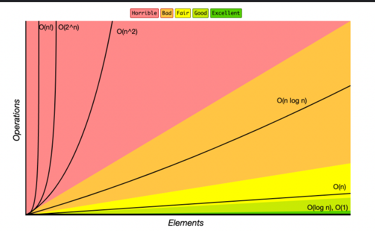

# Prog_224_W24_BigO_031324



Big O
https://www.freecodecamp.org/news/big-o-cheat-sheet-time-complexity-chart/

Traversing a matrix in a spiral order involves moving along the outer edges of the matrix first and then spiraling inward. Here's a C# code snippet to traverse a matrix in a spiral order:

```csharp
using System;

class Program
{
    static void Main(string[] args)
    {
        int[,] matrix = {
            { 1, 2, 3, 4 },
            { 5, 6, 7, 8 },
            { 9, 10, 11, 12 },
            { 13, 14, 15, 16 }
        };

        Console.WriteLine("Original Matrix:");
        DisplayMatrix(matrix);

        Console.WriteLine("\nSpiral Order Traversal:");
        SpiralOrderTraversal(matrix);
    }

    static void SpiralOrderTraversal(int[,] matrix)
    {
        int rows = matrix.GetLength(0);
        int columns = matrix.GetLength(1);
        int top = 0;
        int bottom = rows - 1;
        int left = 0;
        int right = columns - 1;
        int direction = 0; // 0: left to right, 1: top to bottom, 2: right to left, 3: bottom to top

        while (top <= bottom && left <= right)
        {
            if (direction == 0)
            {
                for (int i = left; i <= right; i++)
                {
                    Console.Write(matrix[top, i] + " ");
                }
                top++;
            }
            else if (direction == 1)
            {
                for (int i = top; i <= bottom; i++)
                {
                    Console.Write(matrix[i, right] + " ");
                }
                right--;
            }
            else if (direction == 2)
            {
                for (int i = right; i >= left; i--)
                {
                    Console.Write(matrix[bottom, i] + " ");
                }
                bottom--;
            }
            else if (direction == 3)
            {
                for (int i = bottom; i >= top; i--)
                {
                    Console.Write(matrix[i, left] + " ");
                }
                left++;
            }

            direction = (direction + 1) % 4;
        }
    }

    static void DisplayMatrix(int[,] matrix)
    {
        int rows = matrix.GetLength(0);
        int columns = matrix.GetLength(1);

        for (int i = 0; i < rows; i++)
        {
            for (int j = 0; j < columns; j++)
            {
                Console.Write(matrix[i, j] + "\t");
            }
            Console.WriteLine();
        }
    }
}
```

This code will traverse the matrix in a spiral order, starting from the top-left corner and moving clockwise. It prints each element in the spiral order traversal.

---

Absolutely! Here's the provided code with comments explaining the time efficiency of each line and its relationship to the Big O notation:

```csharp
using System;
using System.Collections.Generic;

class Program
{
    static void Main(string[] args)
    {
        char[] set = { 'a', 'b', 'c' };
        GenerateSubsets(set);
    }

    static void GenerateSubsets(char[] set)
    {
        int n = set.Length;

        // Outer loop for generating subsets of different sizes
        // Time Complexity: O(2^n), as the number of iterations doubles with each increment of 'size'
        for (int size = 0; size <= n; size++)
        {
            // Inner loop for generating subsets of a specific size
            // Time Complexity: O(2^n), as it iterates through all possible combinations of 'n' elements
            for (int i = 0; i < (1 << n); i++)
            {
                List<char> subset = new List<char>();

                // Iterate through each element of the set
                // Time Complexity: O(n), as it iterates through each element of the set
                for (int j = 0; j < n; j++)
                {
                    // Check if jth bit of i is set
                    // Time Complexity: O(1), as it performs bitwise operation
                    if ((i & (1 << j)) > 0)
                    {
                        // If set, add corresponding element to subset
                        // Time Complexity: O(1), as it appends an element to the subset list
                        subset.Add(set[j]);
                    }
                }

                // If the size of the subset matches the current iteration of the outer loop,
                // print the subset
                // Time Complexity: O(1), as it prints the subset
                if (subset.Count == size)
                {
                    Console.Write("{ ");
                    foreach (char item in subset)
                    {
                        // Time Complexity: O(1), as it prints an element of the subset
                        Console.Write(item + " ");
                    }
                    Console.WriteLine("}");
                }
            }
        }
    }
}
```

These comments provide insight into the time complexity of each line of the code and how it contributes to the overall time complexity of the algorithm.